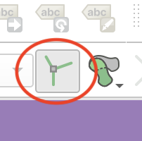
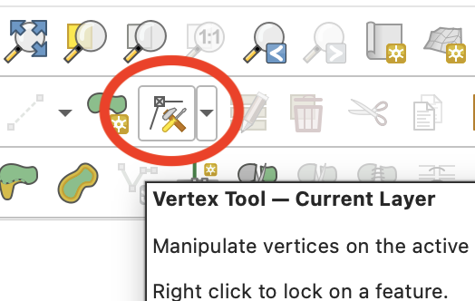
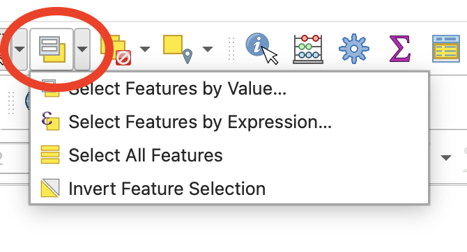
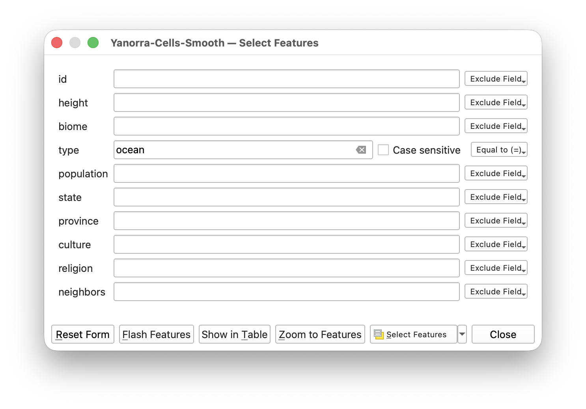

This repository holds the data for the Yanorra maps and the code to generate them. 

## Steps to Importing Data from Azkaar's Map Generator into QGIS

A lot of these steps were taken from Azkaar's Map Generator documentation [here](https://github.com/Azgaar/Fantasy-Map-Generator/wiki/GIS-data-export) this set of YouTube tutorials:

- Part 1: [https://www.youtube.com/watch?v=WIqd_WK2cvM](https://www.youtube.com/watch?v=WIqd_WK2cvM)
    - exporting data from Azkaar's Map Fantasy Generator
    - smoothing out the edgedd of the cells using `add_random_points.php`
    - importing the data into QGIS
    - removing cells labeled as "ocean" and "sea"
    - importing nation/border data
- Part 2: [https://www.youtube.com/watch?v=C8mZKV9vVp4](https://www.youtube.com/watch?v=C8mZKV9vVp4)
- Part 3: [https://www.youtube.com/watch?v=3Ut4hoiprC0](https://www.youtube.com/watch?v=3Ut4hoiprC0)
- Part 4: [https://www.youtube.com/watch?v=OMAoV90RFS4](https://www.youtube.com/watch?v=OMAoV90RFS4)
- Part 5: [https://www.youtube.com/watch?v=5fKMqzuMuQg](https://www.youtube.com/watch?v=5fKMqzuMuQg)

### 1. Export the map from **Azkaar's Map Generator**

In the `Export` menu, under `Export to GeoJSON` select the `Cells` button. This will download a file with the extension `.geojson`.

### 2. Smooth the cell data using `add_random_points.php`

The raw cell data inside the `.geojson` file generated from Azkaar's Map Generator has very jagged borders. To smooth them out, we can add random points along the borders of the cells. 

```bash
php add_random_points.php cells.geojson > cells_smoothed.geojson
```
### 3. Import the data into QGIS

In QGIS, go to `Layer` > `Add Layer` > `Add Vector Layer`. Then under `Source` select the `cells_smoothed.geojson` file. This will import the cell data into QGIS.

### 4. Fixing Cell Data

To find the bad cells, do `Vector` > `Geometry Tools` > `Check Validity`. This will create a new layer with all the invalid cells. 

With the correct layer selected, press `Toggle Editing` and then select the `Vertex Tool`. This will allow you to edit the vertices of the cells.

The point randomizer will sometimes flip points on thin lines to the wrong side, so when moving the verticies, you must make sure to fix adjacent cells at the same time. To ensure that, you must first right-mouse click on the toolbar and select `Advanced Digitizing Toolbar`. In that toolbar, select the `Enable Topological Editing` button. This will ensure that when you move a vertex, it will move the adjacent vertex as well.

_Vertex Tool_<br/>


<br/>

_Enable Topological Editing Button_<br/>
x

There are two types of error that are most common: 

**1.** A single vertex extending out from the vertix, creating a line that extends out from the cell. This can be fixed by selecting the vertex and deleting it.

**2.** A single vertex is flipped to the wrong side of the line, creating a small triangle. This can be fixed by moving the vertex back to the correct side of the line.

### 5. Removing ocean and sea cells

To remove the ocean and sea cells, we can use the `Select Features by Value` tool. This tool allows us to select all the cells that have a certain value in a certain column. In this case, we want to select from the `type` column all the cells that have the value `ocean`. 

_Select Features By Value_<br/>


_Select Features By Value Dialog_<br/>



Once we have selected those cells, we can delete them using the `Delete Selected` button. 

_Delete Selected Button_<br/>


## Tools

This project makes extensive use of:
- [Azkaar's Map Generator](https://github.com/azgaar/Fantasy-Map-Generator/)
- [QGIS](https://www.qgis.org/en/site/)

## Scripts

### `add_random_points.php`

This script is used after importing `cells` from [Azkaar's Map Generator](https://github.com/azgaar/Fantasy-Map-Generator/) into QGIS in order to smooth out the borders of the cells. 

Useage:
```bash
php add_random_points.php <filename> > <newfilename>
```
